<!--
  SEO KEYWORDS: Innoze, Innoze Tech, Innoze Tech Solutions, InnozeTech,
  innoze github, innoze tech github, innoze tech solutions github, 
  Healthcare Management System, Doctor Appointment Booking, Clinic Management System,
  Hospital Management System, Digital Prescription System, Patient Management Pakistan,
  MERN Stack Healthcare, React Healthcare App, Online Doctor Booking Pakistan,
  Appointment Booking System, Prescription Management, Patient History Tracking,
  Full Stack Healthcare Platform, Telemedicine Platform Pakistan, Clinic Software Pakistan,
  Innoze, Innoze Tech, Software House Pakistan, hospital-management-system,
  clinic-management-system, doctor-appointment-booking-system, healthcare, prescription-management
-->

<h1>🏥 Prescripto — Smart Healthcare Management System</h1>

A production-ready, full-stack <strong>Clinic & Hospital Management Platform</strong> built by <strong><a href="https://github.com/innozetech">Innoze</a></strong> — with dedicated portals for Patients, Doctors, and Admins to manage appointments, digital prescriptions, and patient history in real-time.

---

## 🎯 The Problem

Most clinics and hospitals in Pakistan still rely on:

- ❌ Manual appointment books & phone calls — leading to double bookings and no-shows
- ❌ Paper prescriptions — easily lost and impossible to track
- ❌ No patient history records — doctors start fresh every visit
- ❌ No admin oversight of doctors and appointments
- ❌ Zero digital presence — patients can't book online 24/7
- ❌ No secure system for patient data and records

---

## ✅ Our Solution

**Innoze** built a complete three-sided healthcare platform — **Patients** book appointments and view digital prescriptions, **Doctors** manage appointments and write prescriptions, and **Admins** oversee the entire clinic operation — all from one seamless system.

> A clinic can now run its entire operation digitally — no phone calls, no paper, no confusion.

---

## 💼 Business Impact

| Before | After |
|:-------|:------|
| Appointments booked via phone calls | ✅ 24/7 self-service online booking |
| Paper prescriptions get lost | ✅ Digital prescriptions — always accessible |
| No patient history tracking | ✅ Complete history with full edit trail |
| No-shows waste doctor time | ✅ Slot-based booking with OTP verification |
| No admin oversight | ✅ Real-time dashboard with full platform stats |
| No data security | ✅ JWT auth + bcrypt encryption |

---

## ✨ Key Features

### 🧑‍⚕️ Patient Portal
- 🔐 Secure registration, login & OTP-based password reset
- 🆔 Auto-generated unique Patient ID for every patient
- 👨‍⚕️ Browse doctors by 6 specialities with availability status
- 📅 Slot-based appointment booking (30-minute slots, 10 AM – 9 PM)
- 📋 View & cancel appointments
- 💊 View complete digital prescriptions issued by doctors
- 📱 Fully responsive — mobile, tablet & desktop

### 🩺 Doctor Portal
- 📊 Personalized dashboard — earnings, appointments & patient count
- 📋 View, complete & cancel appointments
- 💊 Write detailed digital prescriptions with:
  - Diagnosis & Symptoms
  - Medicines & Instructions
  - Lab Tests & Next Visit date
- ✏️ Edit prescriptions with full edit history tracking
- 🗂️ View complete history of all treated patients
- 👤 Manage profile, fees & availability status

### 🛡️ Admin Portal
- 📈 Platform dashboard — total doctors, appointments & patients
- ➕ Add, edit & manage doctors with photo upload
- 📋 View & cancel any appointment on the platform
- 🗂️ View completed appointment history
- 🔑 Dual login — Admin & Doctor from same panel

---

## 🛠️ Tech Stack

| Layer | Technology |
|:------|:-----------|
| **Frontend** | React 19, Vite, Tailwind CSS, React Router |
| **Backend** | Node.js, Express.js 5 |
| **Database** | MongoDB Atlas, Mongoose |
| **Auth** | JWT, bcrypt, OTP via Nodemailer |
| **Media Storage** | Cloudinary |
| **Email** | Gmail SMTP via Nodemailer |
| **Deployment** | Vercel |

---

## 📸 Project Screenshots

### 🧑‍⚕️ Patient Portal

<table>
  <tr>
    <td align="center">
      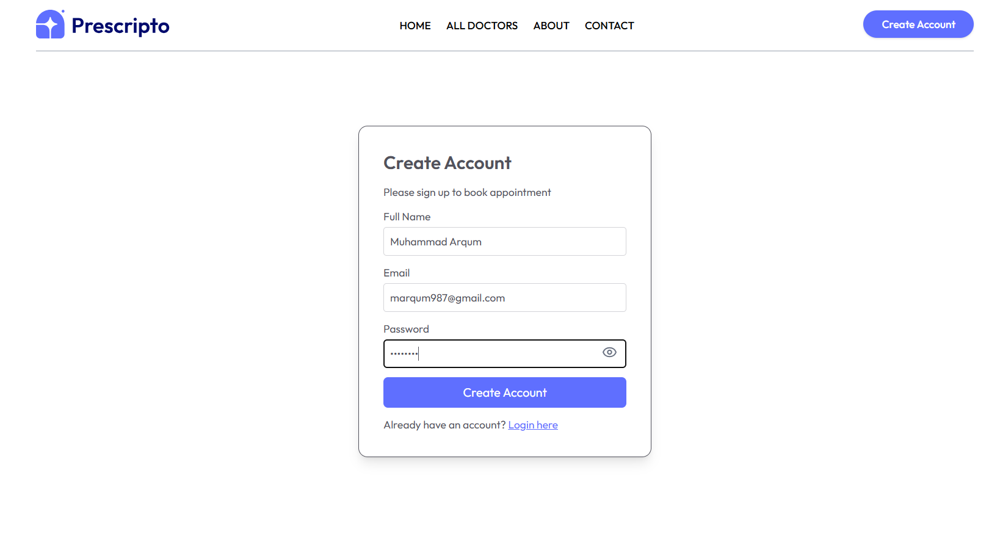
       <b>📝 Register</b>
    </td>
    <td align="center">
      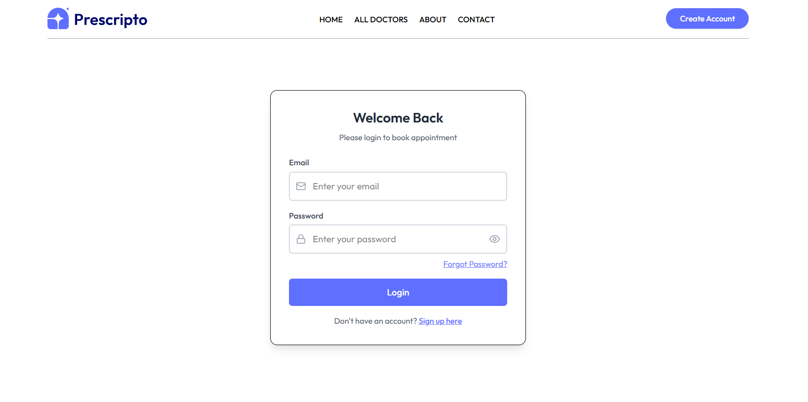
       <b>🔐 Login</b>
    </td>
  </tr>
  <tr>
    <td align="center" colspan="2">
      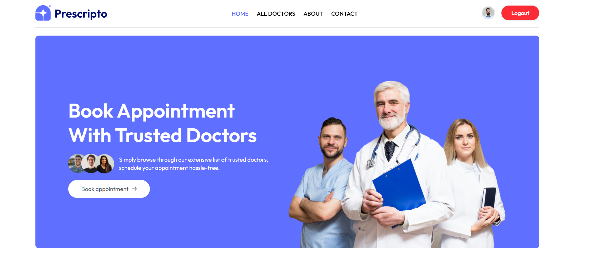
       <b>🏠 Home — Hero Section</b>
    </td>
  </tr>
  <tr>
    <td align="center">
      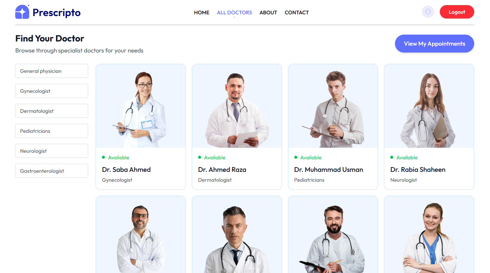
       <b>👨‍⚕️ Browse Doctors by Speciality</b>
    </td>
    <td align="center">
      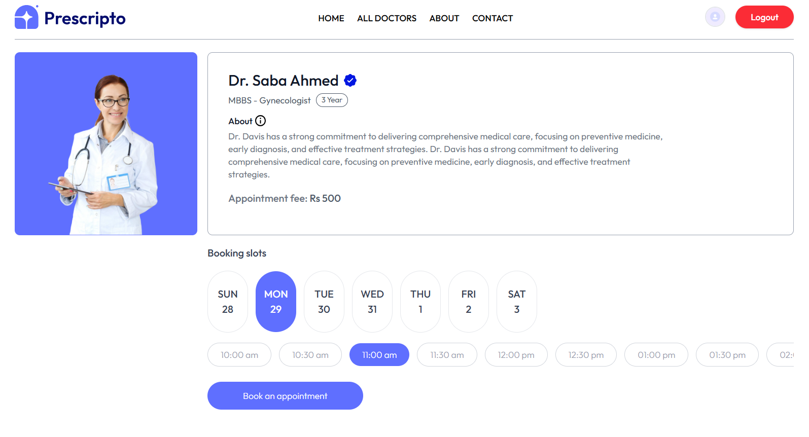
       <b>📅 Appointment Booking</b>
    </td>
  </tr>
  <tr>
    <td align="center">
      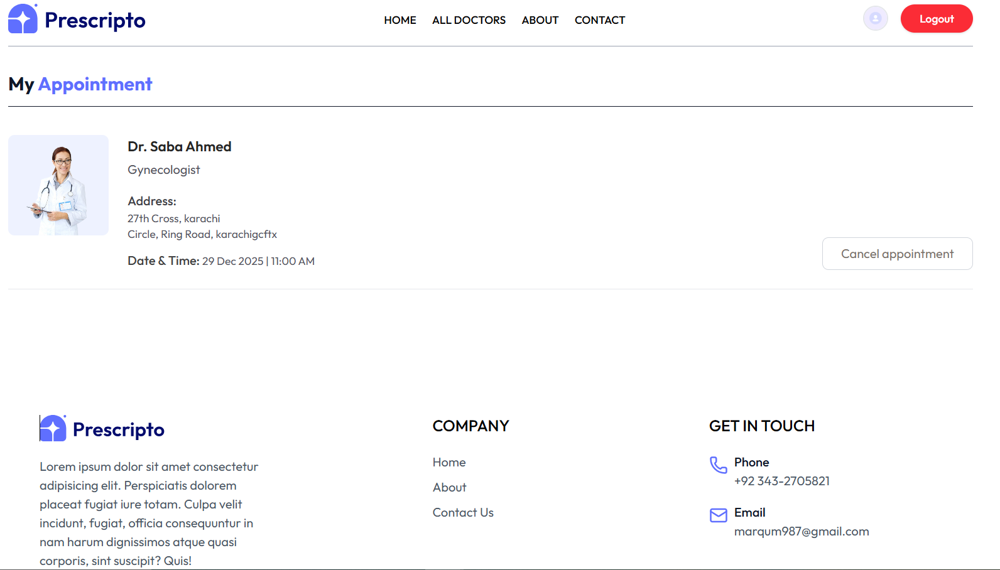
       <b>📋 My Appointments</b>
    </td>
    <td align="center">
      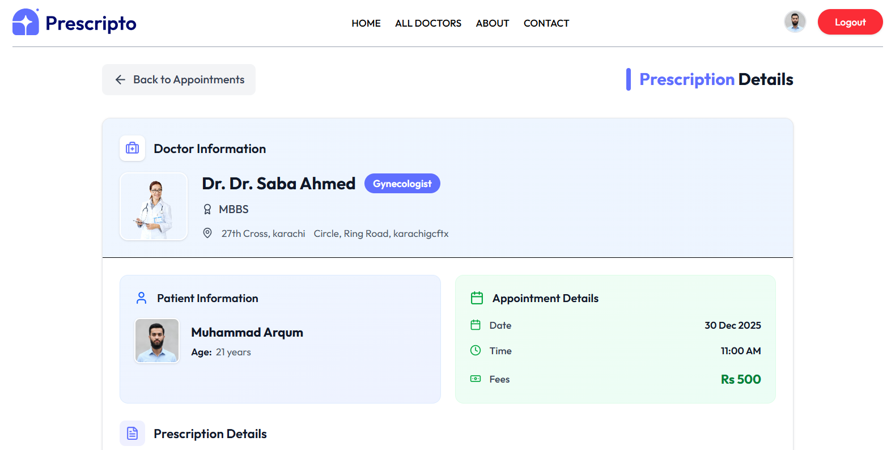
       <b>💊 Digital Prescription</b>
    </td>
  </tr>
</table>

### 🩺 Doctor Portal

<table>
  <tr>
    <td align="center">
      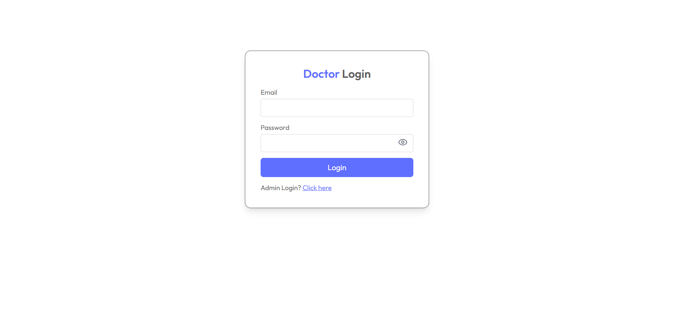
       <b>🔑 Doctor Login</b>
    </td>
    <td align="center">
      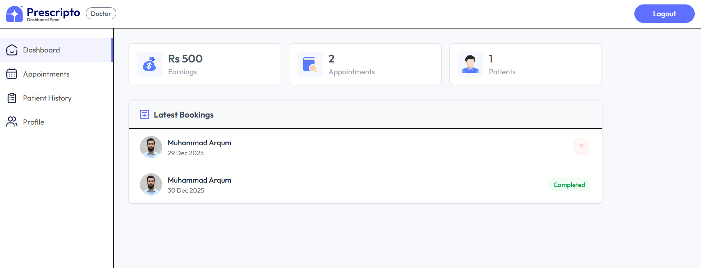
       <b>📊 Doctor Dashboard</b>
    </td>
  </tr>
  <tr>
    <td align="center">
      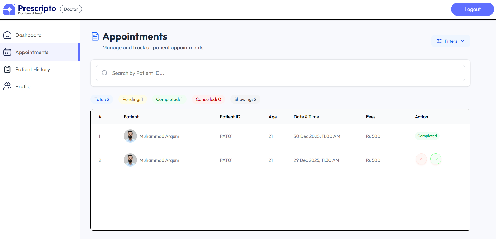
       <b>📋 Appointments List</b>
    </td>
    <td align="center">
      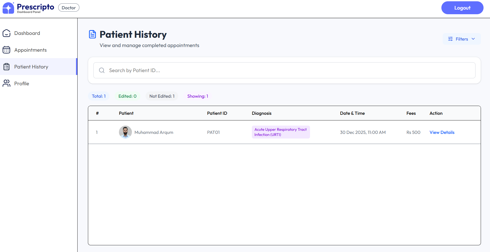
       <b>🗂️ Patient History</b>
    </td>
  </tr>
</table>

### 🛡️ Admin Portal

<table>
  <tr>
    <td align="center">
      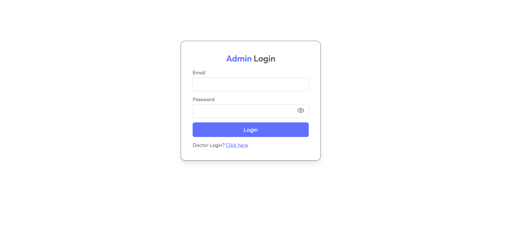
       <b>🔑 Admin Login</b>
    </td>
    <td align="center">
      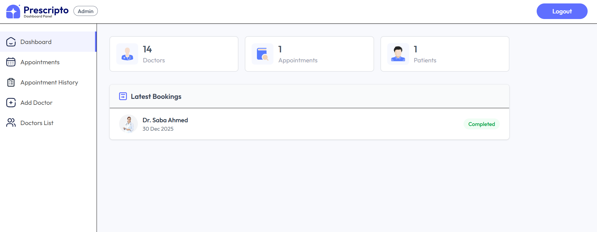
       <b>📈 Admin Dashboard</b>
    </td>
  </tr>
  <tr>
    <td align="center">
      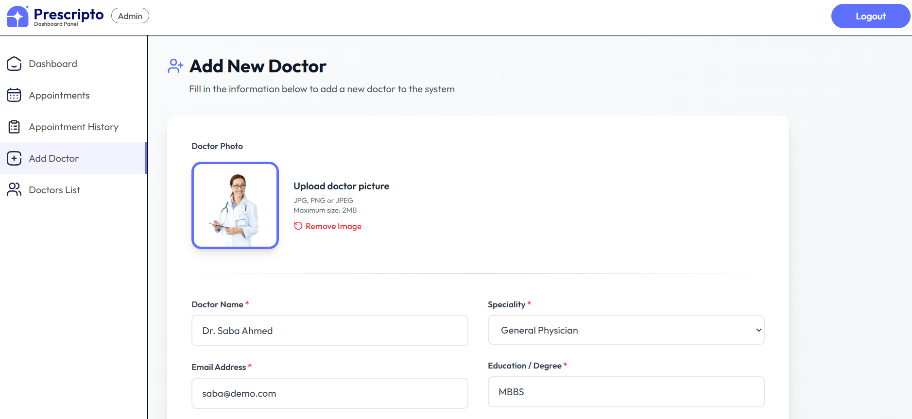
       <b>➕ Add Doctor</b>
    </td>
    <td align="center">
      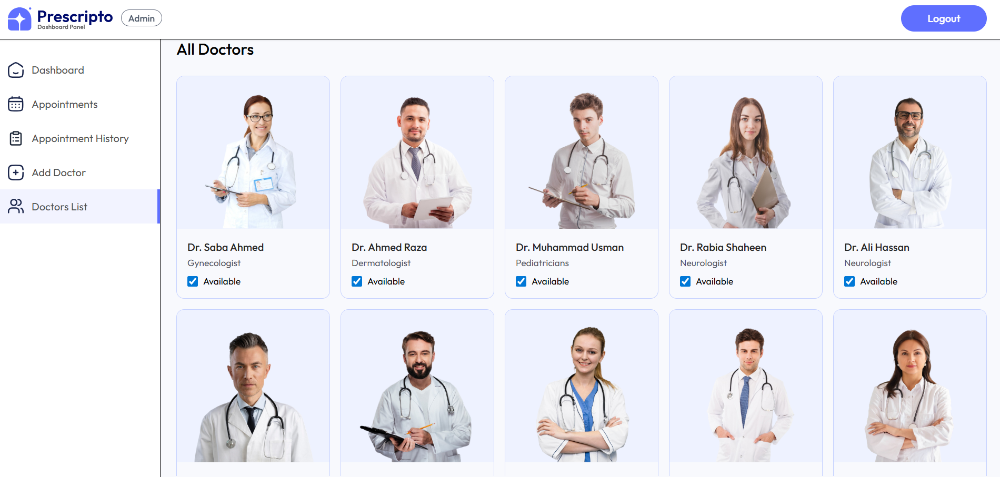
       <b>👨‍⚕️ Doctors List</b>
    </td>
  </tr>
  <tr>
    <td align="center">
      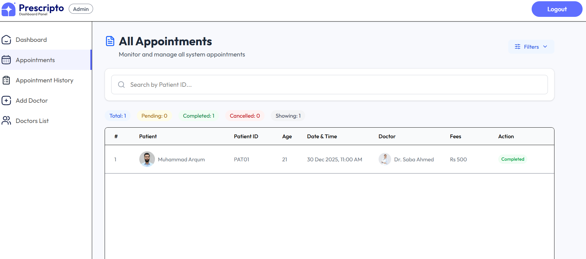
       <b>📋 All Appointments</b>
    </td>
    <td align="center">
      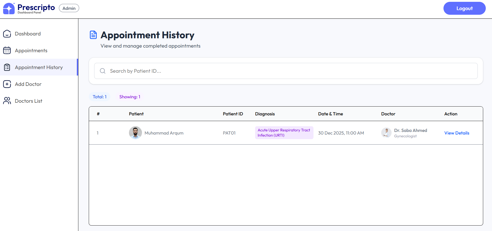
       <b>🗂️ Appointment History</b>
    </td>
  </tr>
</table>

---

## 🌟 Why Innoze Built This

At **Innoze**, we engineer solutions that solve real-world problems. Prescripto was built to bring Pakistani clinics and hospitals into the digital age — replacing paper, phone calls, and manual processes with a **secure, scalable, and intelligent healthcare platform**.

> This project demonstrates our capability to build **multi-role, enterprise-grade systems** with complex business logic, secure authentication flows, and clean modern UI/UX.

---

## 🤝 Want This System for Your Clinic or Hospital?

> Need an appointment booking system, patient management platform, or custom healthcare solution?
>
> **Innoze is here to build it, design it, and grow it with you.**

 

&nbsp;

---

  Built with ❤️ by <strong><a href="https://github.com/innozetech">Innoze</a></strong> — Karachi, Pakistan 🇵🇰

